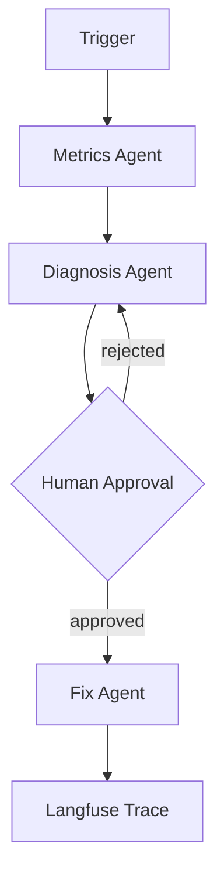

# Write-Up 4: Building a Multi-Agent System You Can Trust

*Due: end of Week 13 — this is the flagship post*

---

## Outline

1. **The problem** — What the capstone agent actually solves and why agents are the right tool
2. **Architecture** — Agent graph diagram, state schema, tool inventory
3. **Human-in-the-loop** — How the approval gate works; why HITL matters in production
4. **Observability** — Langfuse traces in a multi-agent system; what to instrument
5. **Eval suite** — How you measured correctness end-to-end
6. **Lessons** — What LangGraph/SDK decisions you'd make differently
7. **The portfolio** — Links to all four live projects

---

## Architecture Diagram

<!-- Embed your architecture diagram here (Mermaid or image) -->

---

## Draft

<!-- Write your post here. Aim for 1,500–2,500 words. This is the flagship — make it count. -->
